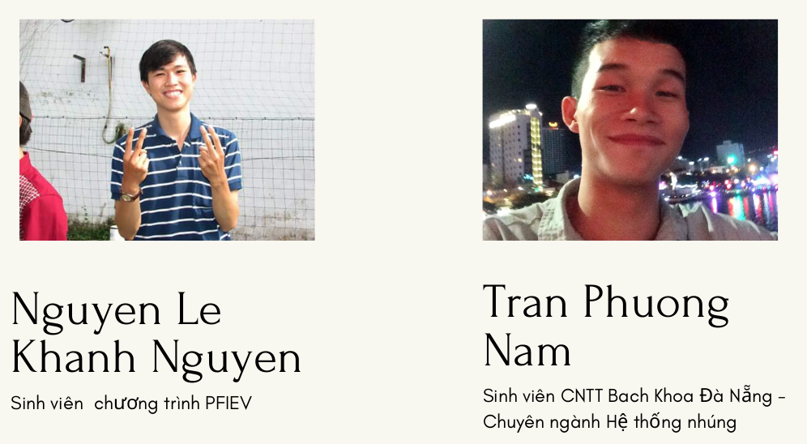
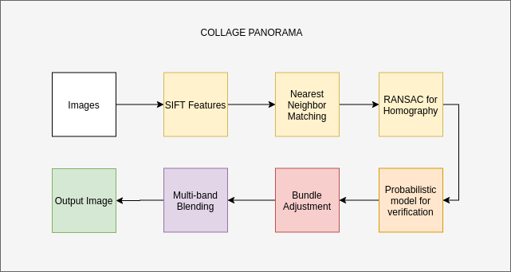

# Collage_Panorama
This repository is for developing the flow of Collage Panorama . 
* [Flow paper](http://matthewalunbrown.com/papers/iccv2003.pdf)

## Table of contents
* [Team](#team)
* [Algorithm](#algorithm  )
* [How To Run This Project](#how-to-run-this-project)
### Teams
[team] 
### Algorithm

[work folows] 
#### algorithm steps
```
Input: n unordered images
    I. Extract SIFT features from all n images
    II. Find k nearest-neighbours for each feature using a k-d tree
    III. For each image:
        (i) Select m candidate matching images (with the maximum number of feature matches to this image)
        (ii) Find geometrically conisistent feature matches using RANSAC to solve for the homography between pairs of images
        (iii) Verify image matches using probabilistic model
    IV. Find connected components of image matches
    V. For each connected component:
        (i) Perform bundle adjustment to solve for the rotation θ1, θ2, θ3 and focal length f of all cameras
        (ii) Render panorama using multi-band blending
Output: Panoramic image(s)
```


